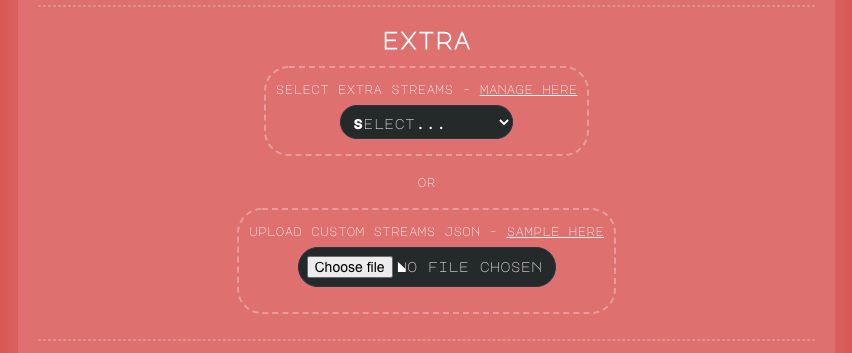

 

# Noiser Extras

This repository has currently one file which matters called `streams.json` 
which holds stream service group names and their corresponding stream addresses as array. 
This data is rendered at https://noiser.io website extra content area and 
Noiser Android application available 
[Google Play](https://play.google.com/store/apps/details?id=com.nitramite.noiser).

 

Adding content
============

Steps
-----
1. Create new branch for your changes.
2. Make changes, see detailed instructions on next section.
3. Create PR (pull request)
4. Rest of the work is done by maintainer unless changes are requested which means looping steps 2 and 4.

Adding streams
-----
`streams.json` is an array having objects. Each object must have name and then streams array. 
* Try have name being as short as possible but describing streams array content.
* Add right stream `country` based on clicking country at [noiser.io](http://noiser.io/) and seeing for browser console for output name.
* Make valid json, use current file content as example. Non valid json is not a problem. Maintainer will verify.

`queryKey` = must be unique, used for local storage current state saving.  
`name` = visible name identifying what stream is.  
`icon` = use always `null` unless you really want to have icon, open issue about it.  
`audioSrc` = stream url ending with something like .mp3, .aac or .m3u8.
